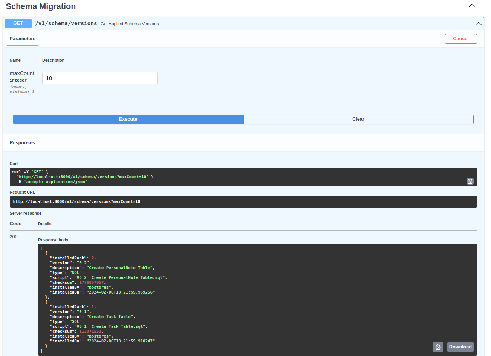

# Starting the Application

This is the back-end and database layer repository of the Personal Life Manager application. The application is designed following a schema like the MVC. The controller here is a Python API written in FastAPI, using Python 3.10 and container setup for the API. The database is setup using the PostgreSQL RDBMS. The credentials for the database should be stored in a .env file, that you must create in the root folder of this repository. The structure must follow the template provided in the .env.example file herein.

The back-end API and database parts can be setup independently from the front-end layer [available in this link](https://github.com/gabogomes/plm-next-ui).

To start the application, make sure you have Docker and Docker Compose installed, as well as proper Internet connection. The command to start the multi-container application locally is:

`docker compose --profile migration up`

Note: The command above with the profile option should only be used if you are either starting the application for the first time in your local machine, or if you want to make some sort of Database Schema change, that would require a flyway migration task to be triggered. For an "ordinary" start of the application that does not fit into one of those categories, you can use

`docker compose up`

You can optionally put a `-d` option at the end, to detach the terminal from the running containers (that might not be ideal since you won't be able to see API responses and database interactions among the corresponding containers).

To access the Swagger / OpenAPI specifications of the API and make requests, you can use the browser, and access `localhost:8000/docs`. No authentication is necessary at this point, but you should have a User's ID (only available if you're inside the Clerk panel for the app registration domain of the application) to access the database records for a given user. To make sure that the database migrations and table cration procedures were performed successfully, access the `v1/schema/versions` resource and make a GET call to the endpoint. You should see a result like the screenshot below.

A status code of 200 and a response containing the records of creation of the two tables (Tasks and Personal Notes) should indicate you are good to go and get started! Clone the front-end repository and start the front-end React application to proceed.

# Other useful commands

Sometimes, you may have problems shutting down the database and API containers. In such case, directly go to the container Terminal and kill the main process. The commands are as follows:

`docker compose exec plm_db bash`

`kill -s SIGINT 1`

`docker compose exec plm_api bash`

`kill -s SIGINT 1`

To remove all the containers you have (running or stopped), the corresponding images of the stack and the volume associated to the database, execute the `clean_stack.sh` script.