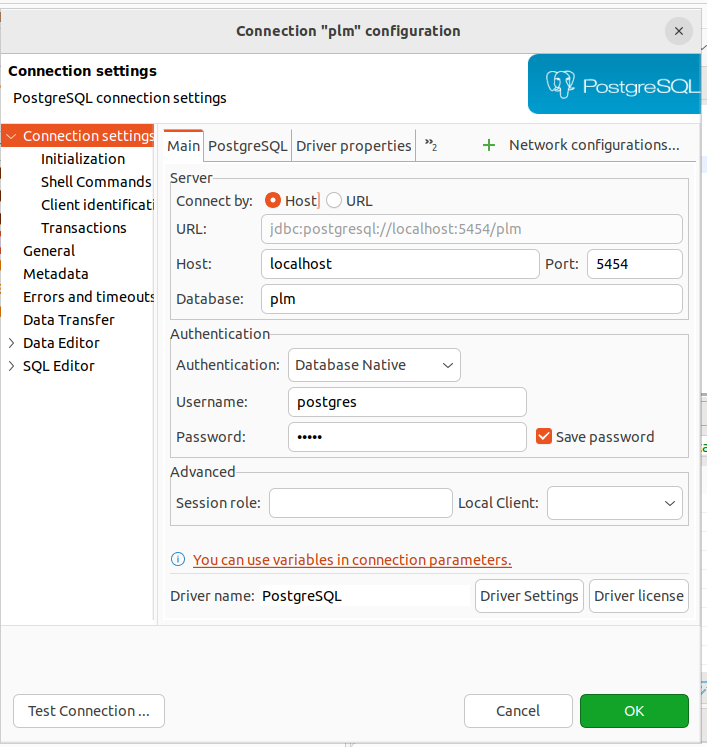

# Setup of SQL Client Software

We decided to use DBeaver, which is a SQL client software application and a database administration tool. For relational databases it uses the JDBC application programming interface (API) to interact with databases via a JDBC driver. This is a desktop application written in Java and based on Eclipse platform. The community edition (CE) of DBeaver is a free and open source software that is distributed under the Apache License. A closed-source enterprise edition of DBeaver is distributed under a commercial license. See the official website for more information [here](https://dbeaver.io/).

# Testing the Database functionalities

After running the Docker Compose stack (see the README file inside the root folder of this repo), you should be able to connect to the database both using the API layer (through the Python ORM with SQLModel) as well as DBeaver (through direct SQL statement interactions with the database). After installing DBeaver, create a new Database Connection and use the following data to fill the fields related to the database information, according to the figure below (screenshot taken directly from local config for the database connection, using DBeaver in its latest version as of January of 2024):



Test the connection using the button in the lower left end of the screen, as in the Figure above. After obtaining the green light from the test, you can save those configuration specs and use the connection to interact with the database. Now it's time to play with the database a little bit. Just create a new SQL Script in DBeaver and paste the following SQL statement:

```sql
SELECT table_name
FROM information_schema.tables
WHERE table_schema = 'public'
AND table_type = 'BASE TABLE';
```

The SQL statement above is going to fetch all the table names corresponding to the database (we removed from the select statement, all the base tables typical of PostgreSQL databases, as it can be seen from the WHERE statement in the code above, which filters both by the table_schema and the table_type parameters).

After running the SQL script, you should see all the tables that we will use to interact with the PLM application through the API. This list of tables includes both application-related tables like the USERS table, as well as other non-application-related tables like the FLYWAY_SCHEMA_HISTORY table, which is the table containing a history of all the database schema migrations applied to the database (those database schema migration SQL statements can also be seen inside the flyway/sql folder of this repository).

Now let us just do a final test to confirm that we can do other actions, like create records inside database tables. For that, create an example user in the USERS table, using the following SQL statement:

```sql
INSERT INTO users (name, email_address, password, created_by, created_on)
VALUES ('My Name', 'myemail@gmail.com', '123456', 'dev@localhost', current_timestamp);
```

After running the script above, just use

```sql
SELECT * from users;
```

You should see, as a result of the query, the user you just created with the INSERT command. You should now be good to go and use the PLM application to interact with the database (by using the Python SQLModel library), or DBeaver (for direct SQL interaction). We emphasize that interacting with databases using directly the SQL commands is not recommended. The only reason we used the INSERT command manually was to confirm that the database is in fact working and we have permissions to create and see data. Please delete the example user using:

```sql
DELETE FROM users
WHERE name = 'My Name' AND email_address = 'myemail@gmail.com' AND password = '123456';
```
